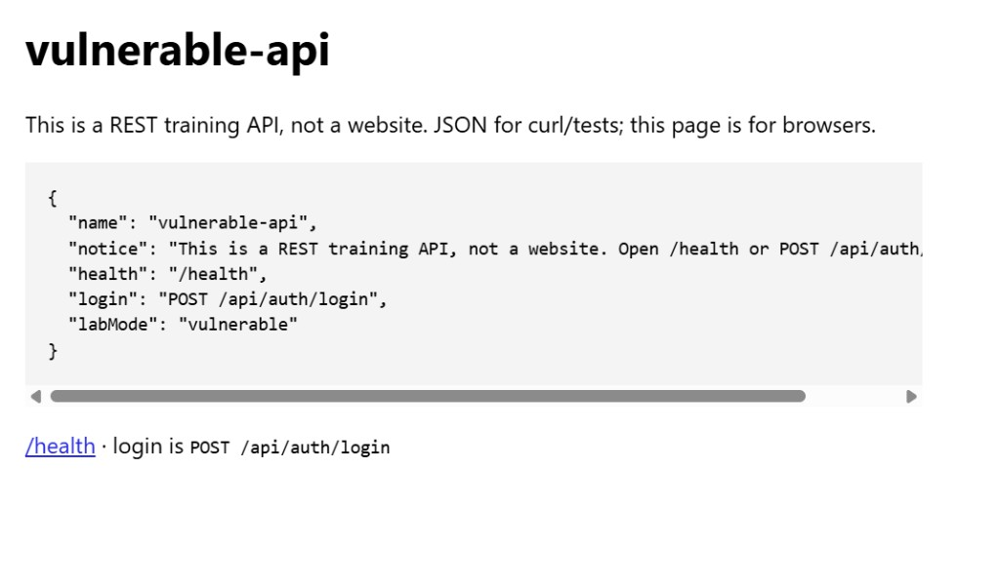
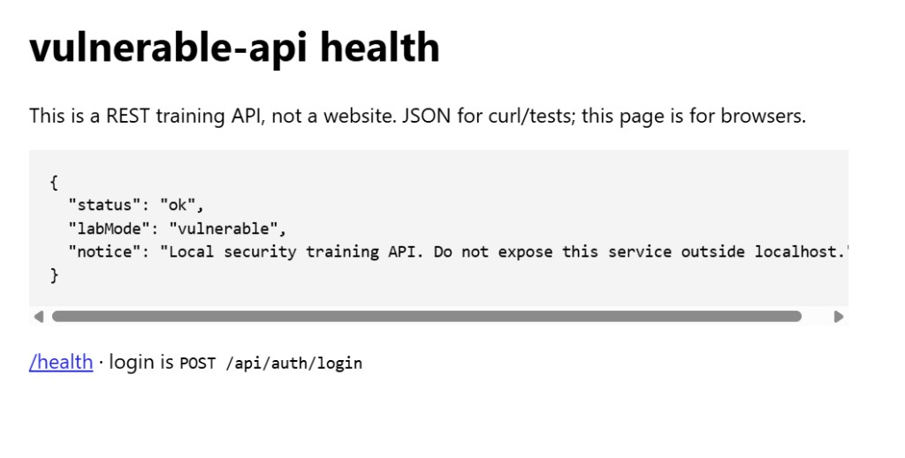

# Security Lab Portfolio

Hands-on cybersecurity portfolio demonstrating practical
web/API security testing, secure coding, DevSecOps automation,
and local RAG access-control labs.

Local labs only. Intentionally vulnerable code is labelled `LAB VULNERABILITY`, gated by `LAB_MODE`, and refused when `NODE_ENV=production`. Compose publishes on `127.0.0.1`. Nothing here targets third-party systems.

| Project | Security area | Skills demonstrated | Evidence |
| --- | --- | --- | --- |
| [vulnerable-api](./web-api-security/vulnerable-api) | **Web/API security** | Broken access control (IDOR / BOLA), authentication and JWT sessions, REST assessment, OWASP API1 / A07 / API2 | [WEB-001](./reports/WEB-001-broken-object-level-authorization.md) · [WEB-002](./reports/WEB-002-authentication-security.md) · [secure tests](./web-api-security/vulnerable-api/tests/secure) |
| Same lab, `LAB_MODE=secure` | **Security engineering** | Vulnerability remediation, secure coding, automated regression testing | [`documentAuthz.ts`](./web-api-security/vulnerable-api/src/authz/documentAuthz.ts) · [`authService.ts`](./web-api-security/vulnerable-api/src/services/authService.ts) · `npm run test:all` |
| [devsecops](./devsecops) + [security.yml](./.github/workflows/security.yml) | **DevSecOps** | Semgrep SAST, Gitleaks, Trivy, npm audit, CI/CD gates | [expected findings](./devsecops/semgrep/expected-findings.md) · [exceptions](./devsecops/exceptions.md) · [green `security.yml` runs](./docs/images/github-actions-security-pipeline.png) |
| [tryhackme](./tryhackme) | **Hands-on training** | Recently started TryHackMe; four **intro** rooms completed (snapshot 20 Aug 2026) | [Profile](https://tryhackme.com/p/karinehei) · [progress.md](./tryhackme/progress.md) · [website card](./website/index.html) |
| [ai-security-lab](./ai-security-lab) | **AI security** | RAG document-level access control, prompt-injection *concepts*, sensitive-data exposure via retrieval, threat modelling | [RAG-ACL-001](./ai-security-lab/scenarios/rag-access-control/README.md) · [threat-model.md](./ai-security-lab/threat-model.md) · [tests](./ai-security-lab/tests) |

Prompt injection is documented as an evaluation design. It is **not** claimed as a completed model-level assessment. There are no certifications, pass-rates, or scorecards in this repository.

---

## Security workflow

```text
Discover → Validate → Assess → Fix → Test → Automate
```

| Step | Meaning in this repo |
| --- | --- |
| **Discover** | Find a missing control in a local lab (`LAB VULNERABILITY` comments) |
| **Validate** | Reproduce on localhost only (documented HTTP or in-process `ask()`) |
| **Assess** | OWASP / CWE / CVSS reasoning and impact in a report or scenario sheet |
| **Fix** | Correct behaviour in `LAB_MODE=secure` (deny-by-default ACL, token `exp`) |
| **Test** | Vitest: vulnerable mode still shows the training defect; secure mode blocks it |
| **Automate** | GitHub Actions: typecheck, tests, Semgrep, npm audit, Gitleaks, image build, Trivy |

Detail: [docs/methodology.md](./docs/methodology.md). Scope: [SECURITY.md](./SECURITY.md), [docs/lab-rules.md](./docs/lab-rules.md).

---

## Two-minute path

1. This table (what is evidenced vs planned).
2. [WEB-001](./reports/WEB-001-broken-object-level-authorization.md) — object-level authorization on `GET /api/documents/:id`.
3. [WEB-002](./reports/WEB-002-authentication-security.md) — JWT expiration (passwords already bcrypt).
4. [RAG-ACL-001](./ai-security-lab/scenarios/rag-access-control/README.md) — same ACL class on retrieval, mock LLM (no vendor API).
5. [`.github/workflows/security.yml`](./.github/workflows/security.yml) — how findings are kept from regressing.
6. [docs/verification-report.md](./docs/verification-report.md) — what was actually run locally.
7. [Hands-on training](#hands-on-training-tryhackme) — TryHackMe profile and honest status.

Full inventory: [skills.md](./skills.md) (rows without artefacts stay **Planned**). Recruiter page: [website/index.html](./website/index.html).

---

## Hands-on training (TryHackMe)

I recently started hands-on cybersecurity training with TryHackMe and am actively building my skills through practical labs and exercises.

I use the platform alongside my own local security labs to practise security concepts and then apply them through implementation, remediation and automated testing. That is early, practical study — not a claim of extensive CTF or advanced pentest experience.

**Public profile:** [https://tryhackme.com/p/karinehei](https://tryhackme.com/p/karinehei)

**Current learning status:** Recently started (`[0x1][NEOPHYTE]`). Four introductory Easy walkthrough rooms are completed. That is early practice — not extensive CTF or pentest experience.

**Snapshot: 20 August 2026** (profile numbers change; live source is the profile): completed rooms **4**, streak **2**, badges **1**, rank **Top 95%**.

**Completed rooms (this repo):** [Offensive Security Intro](./tryhackme/notes/offensive-security-intro.md), [Defensive Security Intro](./tryhackme/notes/defensive-security-intro.md), [Inside a Computer System](./tryhackme/notes/inside-a-computer-system.md), [Careers in Cyber](./tryhackme/notes/careers-in-cyber.md). Table: [tryhackme/progress.md](./tryhackme/progress.md).

**Current cybersecurity learning areas** (focus for training; web / OWASP / API **rooms** are still Planned):

| Area | Evidence in this repository | TryHackMe in this repo |
| --- | --- | --- |
| Web application security | [WEB-001](./reports/WEB-001-broken-object-level-authorization.md) | Planned |
| Penetration testing fundamentals | [methodology.md](./docs/methodology.md), pentest-style [reports](./reports) | Intro room completed; deeper path Planned |
| OWASP vulnerabilities | WEB-001 (API1 / BOLA), WEB-002 (A07 / API2) | Planned |
| Authentication and authorization | [WEB-002](./reports/WEB-002-authentication-security.md), document ACL | Planned |
| API security | Local Express API + dual-mode tests | Planned |
| Linux and networking fundamentals | WSL / Docker on loopback only — not a completed course | TODO — no room claimed |
| Security tooling | Semgrep, Gitleaks, npm audit, Trivy, GitHub Actions | TODO — no room claimed |

Platform notes: [tryhackme/README.md](./tryhackme/README.md) · [progress.md](./tryhackme/progress.md) · [skills-mapping.md](./tryhackme/skills-mapping.md).

```text
TryHackMe exercise → concept → own local lab → analysis → remediation → regression tests
```

---

## Run locally

This is a **localhost lab**. Do not bind it to a public interface or deploy the images.

**Need:** WSL (Ubuntu), Docker, Node.js 22+. On Windows, open WSL first.

```powershell
wsl -d Ubuntu-24.04
```

```bash
cd /mnt/d/security-lab-portfolio
make up
```

That starts the document API and Postgres on loopback. Compose default is `LAB_MODE=vulnerable`.

| What | Where |
| --- | --- |
| API (no HTML UI) | `http://127.0.0.1:3000/` → JSON index |
| Health | `http://127.0.0.1:3000/health` → `"labMode": "vulnerable"` |
| Postgres | `127.0.0.1:5432` (user/password/db: `lab` / `lab` / `documents_lab`) |

```bash
curl http://127.0.0.1:3000/health
```

If the editor Simple Browser looks blank, that is JSON in a viewer that does not paint it. Use `curl`, tick Pretty-print, or open the URL in Chrome. After a rebuild, browsers that send `Accept: text/html` get a short HTML page:



`labMode` here is `vulnerable` because that is the Compose default. Click `/health` on that page, or open `http://127.0.0.1:3000/health`:



Secure mode: `make up-secure`. Stop: `make down`.

Seeded accounts (password for all: `LabPassw0rd!`): `alice@local.lab`, `bob@local.lab`, `admin@local.lab`.

```bash
curl -s http://127.0.0.1:3000/api/auth/login \
  -H "Content-Type: application/json" \
  -d '{"email":"alice@local.lab","password":"LabPassw0rd!"}'
```

Host API with Postgres in Docker: `make setup` then `make api-dev`.

RAG lab has no HTTP listener:

```bash
cd ai-security-lab && npm install
LAB_MODE=vulnerable npx tsx src/index.ts --user alice --query merger
LAB_MODE=secure npx tsx src/index.ts --user alice --query merger
```

`make help` lists install, tests, and scanners. Detail: [vulnerable-api README](./web-api-security/vulnerable-api/README.md), [ai-security-lab README](./ai-security-lab/README.md). If Docker pull fails with a credentials error, retry with `DOCKER_CONFIG=/tmp/empty-docker`.

---

## Safety

- Vulnerable mode cannot start if `NODE_ENV=production`.
- API Compose ports: `127.0.0.1:3000` and `127.0.0.1:5432` only.
- Host default bind: `LISTEN_HOST=127.0.0.1`. Inside Compose the process listens on `0.0.0.0` **in the container**; the published ports remain loopback.
- RAG lab is in-process (no HTTP listener).
- Lab passwords and JWT material are fictional placeholders.

Do not deploy these images or bind them to a public interface.
