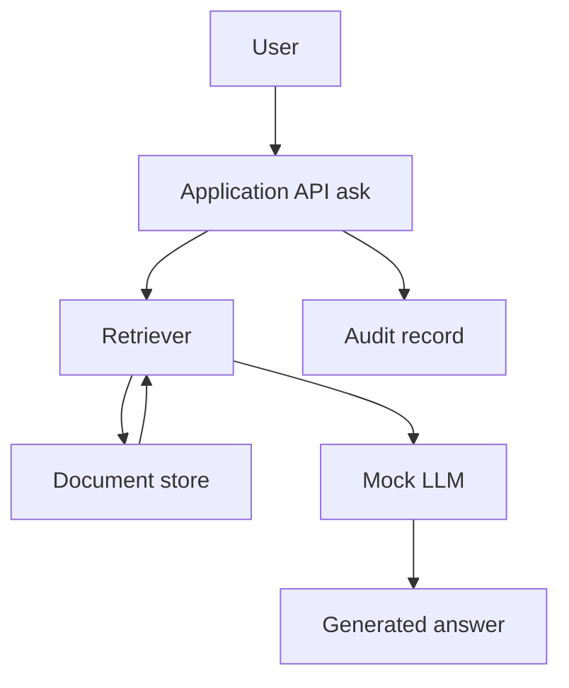

# Threat model — local RAG lab

Scope: the synthetic system in this folder (in-memory documents, keyword retriever, mock generator). **Out of scope:** any cloud LLM API, production tenant, or third-party assistant.

## Data flow

Trust boundaries:

1. **Identity** — the caller of `ask()` is an `Actor` chosen in the lab CLI/tests (stands in for an authenticated API user).
2. **Store** — documents have `ownerId`. This is the authorization source of truth.
3. **Context window** — whatever the retriever returns is treated as readable by the generator. There is no second secret filter inside the mock LLM.
4. **Output** — the answer is returned to the same user. The mock does not call tools.

If authorization is missing at (2)→retriever, (3) and (4) will leak. Asking the model to “not reveal secrets” is not a control.

## Assets

| Asset | Why it matters |
| --- | --- |
| Private document text (Alice/Bob markers) | Confidential HR / deal data analogue |
| Document owner identifiers | Tenancy metadata |
| User queries | May themselves be sensitive |
| Audit trail (`retrievedDocumentIds`) | Detection and investigation |
| System behaviour (who can retrieve what) | Integrity of the product promise |

## Threat areas

Mapped to published **OWASP Top 10 for Large Language Model Applications** category *names* where the fit is clear. Version labels (2023 vs 2025) differ slightly; I use the common names and do not claim a formal OWASP assessment of a production app.

| Area | What it means here | OWASP LLM (aligned) | Status in this lab |
| --- | --- | --- | --- |
| Direct prompt injection | User query tries to override policy | Prompt Injection | Documented; not executed against a real model |
| Indirect prompt injection | Retrieved document tries to override policy | Prompt Injection (indirect) | Documented |
| Malicious retrieved content | Store contains hostile or misleading text | Prompt Injection / poisoning | Documented; store is seeded and local |
| Cross-user document retrieval | Retriever returns another tenant’s chunk | Vector/embedding & access weaknesses; also API1-style BOLA | **Implemented** |
| Inadequate document-level authorization | ACL only on a later GET, not on search | Same as above; CWE-285 / CWE-639 class | **Implemented** |
| Sensitive information disclosure | Private markers appear in the answer | Sensitive Information Disclosure | Partially evidenced via RAG ACL tests |
| Excessive LLM/tool permissions | Model can call tools / fetch URLs | Excessive Agency | Not implemented (mock has no tools) — listed as residual |
| Weak audit logging | No record of which chunk IDs were used | — (operational control) | Minimal audit object on each `ask()` |
| Unsafe trust in generated output | Caller executes or displays answer as fact/code | Insecure / improper output handling | Documented; mock output is plain text |

## STRIDE (compact)

| STRIDE | Example in this design |
| --- | --- |
| Spoofing | Calling `ask()` as another actor — mitigated in a real API by WEB-002-style authn; here tests pass an `Actor` explicitly |
| Tampering | Writing Bob’s document as Alice — not in v1 (read-only store) |
| Repudiation | Denying a retrieval — `audit.retrievedDocumentIds` is the start of a trail |
| Information disclosure | Alice sees `MARKER_BOB_PRIVATE_*` | **Primary v1 threat** |
| Denial of service | Huge query / unbounded k — k is capped; not a load test |
| Elevation of privilege | USER retrieving as if ADMIN — secure ACL denies; admin is explicit |

## Trust we refuse

- The language model as an authorization engine
- Similarity search as a substitute for `ownerId`
- “The UI only shows my docs” as a retrieval guarantee
