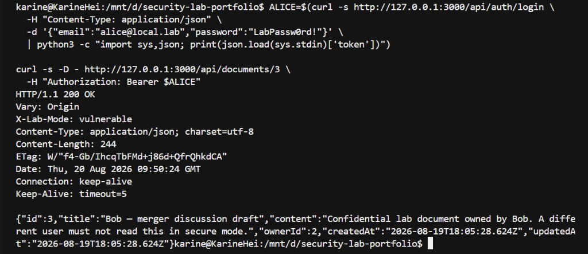
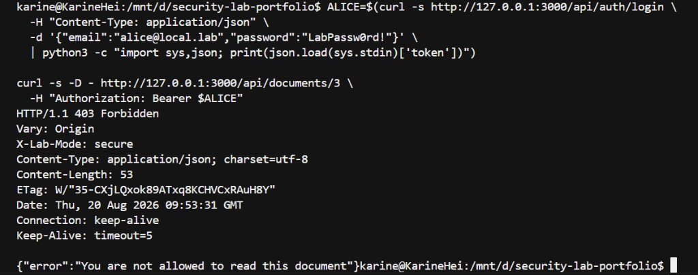

# WEB-001 — Broken Object Level Authorization (IDOR)

| Field | Value |
| --- | --- |
| **Finding ID** | WEB-001 |
| **Title** | Broken Object Level Authorization on document read |
| **OWASP category** | OWASP API Security Top 10 (2023) — **API1:2023 Broken Object Level Authorization** |
| **CWE** | [CWE-639](https://cwe.mitre.org/data/definitions/639.html) Authorization Bypass Through User-Controlled Key; related [CWE-285](https://cwe.mitre.org/data/definitions/285.html) Improper Authorization |
| **Severity** | **High** (confidential user documents; trivial to exercise once authenticated) |
| **CVSS 3.1 base** | **6.5 Medium** — `CVSS:3.1/AV:N/AC:L/PR:L/UI:N/S:U/C:H/I:N/A:N` |
| **Affected component** | Local lab API `GET /api/documents/:id` in [web-api-security/vulnerable-api](../web-api-security/vulnerable-api) |
| **Lab modes** | Present when `LAB_MODE=vulnerable`. Absent when `LAB_MODE=secure`. |
| **Status** | Intentional training defect + remediated secure path + automated tests |

This finding applies only to the **intentionally vulnerable document API in this repository**, running on `127.0.0.1`. It is not an assessment of any third-party system.

---

## CVSS reasoning

| Metric | Choice | Why |
| --- | --- | --- |
| Attack Vector | Network | The control is an HTTP API. In this lab the listener is loopback; the vector still models a typical deployed API. |
| Attack Complexity | Low | The caller changes a numeric `:id`. No special conditions. |
| Privileges Required | Low | A valid normal-user JWT is enough. Admin is not required. |
| User Interaction | None | The other user does not need to click or approve. |
| Scope | Unchanged | Confidentiality impact stays in the document service. |
| Confidentiality | High | Full document `content` is returned. |
| Integrity | None | This iteration is a **read** issue only (`GET`). |
| Availability | None | The service is not disrupted. |

The **base score is 6.5 (Medium)**. This report rates the finding **High** for the lab's document classification: objects are user-private records, identifiers are sequential, and the list endpoint already proves that the designers *intended* isolation. In a product with regulated or customer-confidential files, that combination is treated as High even when Integrity is not in play.

If a later iteration adds `PUT`/`DELETE` without object ACL, Integrity would rise and the base score would increase.

---

## Description

The API stores documents with an `ownerId`. `GET /api/documents` already filters by owner for role `USER`. `GET /api/documents/:id` in vulnerable mode does **not** repeat that check. Any authenticated user who can guess or obtain another user's document id receives `200` and the other user's `title` and `content`.

That is Broken Object Level Authorization: authentication succeeded, route-level authorization ("is logged in") succeeded, **object-level** authorization failed.

### Penetration tester perspective

The interesting signal is inconsistency. The collection endpoint behaves as if documents are private. The item endpoint behaves as if every document is readable by any session. Sequential ids (`1`, `2`, `3`, …) make neighbouring objects trivial to request. The tester does not need a second vulnerability (IDOR often coexists with enumeration; here enumeration is inherent in the key design).

### Software developer perspective

The handler loads a row by primary key and serializes it. Ownership lives on the row but is not part of the **authorization decision**. Filtering a list query is not a substitute for authorizing a get-by-id. The secure fix is a deny-by-default function: allow if `ownerId === actor.id` or `actor.role === ADMIN`, otherwise `403`.

---

## Prerequisites

- The lab process is running locally (`docker compose up` or `npm run dev`).
- `LAB_MODE=vulnerable` (Compose default).
- A seeded normal user, for example `alice@local.lab` / `LabPassw0rd!`.
- Knowledge of another user's document id (from Bob's own `GET /api/documents`, from a `POST` as Bob, or from sequential guessing of seed rows).

No production credentials and no access to systems outside this repository are required.

---

## Reproduction

Perform these calls only against `http://127.0.0.1:3000`.

### 1. Confirm lab mode

```http
GET /health HTTP/1.1
Host: 127.0.0.1:3000
```

Vulnerable mode returns `"labMode": "vulnerable"`.

### 2. Authenticate as Alice

```http
POST /api/auth/login HTTP/1.1
Host: 127.0.0.1:3000
Content-Type: application/json

{"email":"alice@local.lab","password":"LabPassw0rd!"}
```

Keep `token` from the JSON body.

### 3. Authenticate as Bob and identify a Bob-owned document

```http
POST /api/auth/login HTTP/1.1
Host: 127.0.0.1:3000
Content-Type: application/json

{"email":"bob@local.lab","password":"LabPassw0rd!"}
```

```http
GET /api/documents HTTP/1.1
Host: 127.0.0.1:3000
Authorization: Bearer <bob-token>
```

Note an `id` whose `ownerId` is Bob. Seeded titles include `Bob — merger discussion draft`.

Alternatively create a fresh object:

```http
POST /api/documents HTTP/1.1
Host: 127.0.0.1:3000
Authorization: Bearer <bob-token>
Content-Type: application/json

{"title":"Bob confidential fixture","content":"Only Bob should read this in secure mode."}
```

### 4. Request Bob's document as Alice (vulnerable mode)

```http
GET /api/documents/<bob-document-id> HTTP/1.1
Host: 127.0.0.1:3000
Authorization: Bearer <alice-token>
```

**Expected in `LAB_MODE=vulnerable`:** `200` and Bob's `content`.

**Expected in `LAB_MODE=secure`:** `403` with an error body and no `content`.

Alice's `GET /api/documents` still lists only Alice's rows in both modes. The defect is the **direct object reference**, not the collection filter.

---

## Evidence

Local capture, `127.0.0.1` only. Document ids can change after extra `POST`s; this run used seeded id `3`.

**Vulnerable mode — Alice reads Bob's object**

Alice's JWT, `GET /api/documents/3`: **200**, `X-Lab-Mode: vulnerable`, Bob's merger `content`, `ownerId: 2`.



```http
HTTP/1.1 200 OK
X-Lab-Mode: vulnerable
Content-Type: application/json

{
  "id": 3,
  "title": "Bob — merger discussion draft",
  "content": "Confidential lab document owned by Bob. A different user must not read this in secure mode.",
  "ownerId": 2,
  "createdAt": "<timestamp>",
  "updatedAt": "<timestamp>"
}
```

`ownerId` is Bob's user id while the Bearer token is Alice's. That single mismatch is the finding.

**Secure mode — same request**

Same Alice token pattern, `GET /api/documents/3`: **403**, `X-Lab-Mode: secure`, no document `content`.



```http
HTTP/1.1 403 Forbidden
X-Lab-Mode: secure
Content-Type: application/json

{"error":"You are not allowed to read this document"}
```

Automated evidence:

- [tests/vulnerable/idor.vulnerable.test.ts](../web-api-security/vulnerable-api/tests/vulnerable/idor.vulnerable.test.ts) — lab mode returns `200` for a cross-user read
- [tests/secure/idor.secure.test.ts](../web-api-security/vulnerable-api/tests/secure/idor.secure.test.ts) — secure mode returns `403` for the same pattern; owner and admin still succeed

---

## Impact

A low-privilege user can read **any document they can address by id**, including records they would never see in `GET /api/documents`.

In this lab that includes compensation notes, merger drafts, and a personal journal. In a real document product the same gap is a confidentiality breach: other tenants' files, HR records, or customer attachments.

Integrity and availability are not demonstrated in this finding. The same missing function would typically be reused for update and delete if those routes were added without an ACL.

---

## Root cause

Authorization is incomplete:

1. `requireAuth` ensures a JWT is present (authentication).
2. `readDocument` loads by primary key.
3. In vulnerable mode, `canReadDocument` returns `true` for every authenticated non-decision — it **skips** `document.ownerId === actor.id`.

```text
authenticate user  →  fetch Document where id = :id  →  serialize
                                              ↑
                         missing: actor may read THIS row
```

The list endpoint uses a `WHERE ownerId = actor.id` query. Developers often assume that if the UI never displays foreign ids, get-by-id is safe. Clients are not a security boundary. Sequential ids (and ids leaked in other responses) make that assumption fail.

The intentional skip is isolated in [`src/authz/documentAuthz.ts`](../web-api-security/vulnerable-api/src/authz/documentAuthz.ts) and labelled `LAB VULNERABILITY`. [`assertLabSafety()`](../web-api-security/vulnerable-api/src/config.ts) prevents that branch from loading when `NODE_ENV=production`.

---

## Remediation

1. Authorize **on the object** after load (or use a query that includes `ownerId` / tenant id).
2. Deny by default. Allow only owner or an explicit privileged role.
3. Do not treat collection filters as get-by-id controls.
4. Keep admin override in one place so it can be audited.
5. Add regression tests that log in as user A and request user B's id.

Optional hardening (not required to close WEB-001):

- Prefer `404` over `403` if document existence should not be confirmed to unauthorized callers.
- Use non-sequential ids to raise the cost of guessing (still not a replacement for ACL).
- Enforce the same helper on future `PATCH`/`DELETE`.

---

## Verification

| Check | Vulnerable | Secure |
| --- | --- | --- |
| Alice `GET` Bob's id | `200` + content | `403` |
| Bob `GET` Bob's id | `200` | `200` |
| Admin `GET` Bob's id | `200` | `200` |
| Alice `GET /api/documents` | Alice's rows only | Alice's rows only |
| `NODE_ENV=production` + `LAB_MODE=vulnerable` | Process must not start | n/a |

Commands (from `web-api-security/vulnerable-api`, with Postgres up):

```bash
npm run test:vulnerable
npm run test:secure
```

Manual: set `LAB_MODE=secure`, restart, repeat the Reproduction request as Alice, confirm `403`.

---

## Secure implementation

The secure path is the `LAB_MODE=secure` branch of `canReadDocument`:

- `ADMIN` → allow
- otherwise allow only when `document.ownerId === actor.id`
- otherwise `ForbiddenError` → HTTP `403`

Call chain: [`documents.ts`](../web-api-security/vulnerable-api/src/routes/documents.ts) `GET /:id` → [`readDocument`](../web-api-security/vulnerable-api/src/services/documentService.ts) → [`canReadDocument`](../web-api-security/vulnerable-api/src/authz/documentAuthz.ts).

That is the engineering artefact for this finding: one authorization function, two lab modes, tests on both sides.

---

## Lessons learned

**From testing.** Collection versus item inconsistency is a high-yield place to look for BOLA. Authenticate as two users; never trust that "the UI would not send that id."

**From engineering.** Object ACL belongs in a dedicated decision, not in a comment on the route and not only in a list query. Role checks (`ADMIN`) and ownership checks must be explicit. A training flag (`LAB_MODE`) must be production-blocked.

**For later modules.** The same pattern applies to RAG document stores: retrieval that ignores owner/tenant on chunk ids is BOLA with extra steps. That work is planned under `ai-security-lab/` and is not claimed as complete here.

---

## References (local)

- Lab README: [web-api-security/vulnerable-api/README.md](../web-api-security/vulnerable-api/README.md)
- Architecture: [docs/architecture.md](../web-api-security/vulnerable-api/docs/architecture.md)
- Methodology: [docs/methodology.md](../docs/methodology.md)
- Skills index: [skills.md](../skills.md)
